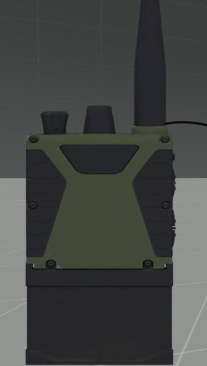
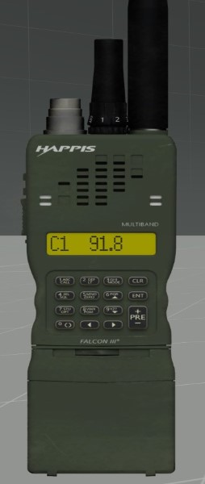
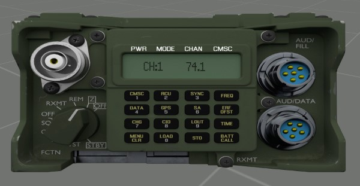
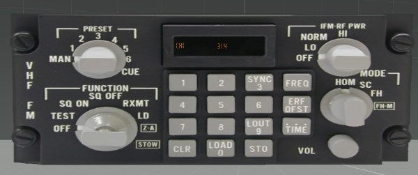
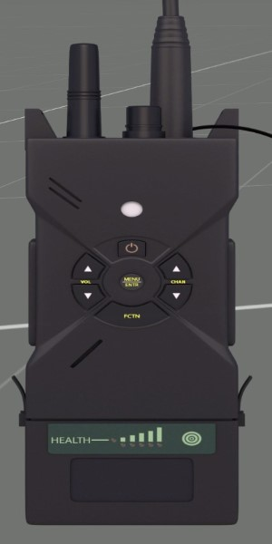
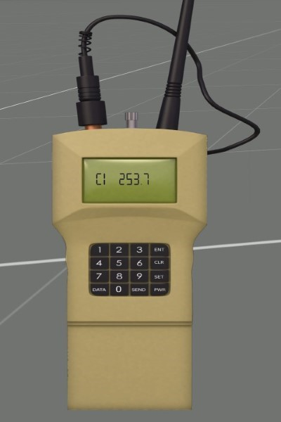
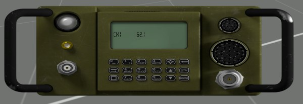
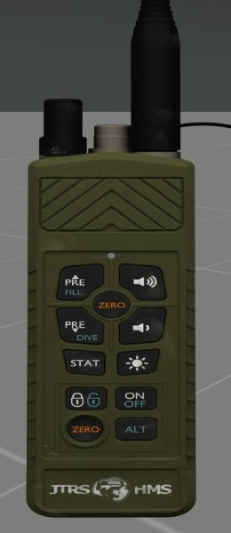
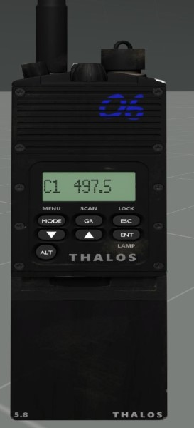
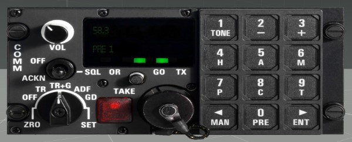

# Communication

How to Use the Radios and their Limits and how to Communicate Properly

## The Technology of TFAR
How to use and what can they do

### The Radio's

|Side| Role | Radio Name | Frequency | Range | Image |
|---|------|------------|-----------|-------|-------:|
|Blue|Infantry | RF-7800S-TR | 30-512MHz | 2 km Range | |
|Blue|SquadLeader | AN/PRC-152 | 30-512 MHz | 5 km Range | |
|Blue| LongRange | RT-1523G | 30-87 MHz | 20 km as Backpack / 30 km when fixed to a Vehicle||
|Blue|Airborne | AN/ARC-210 | 30-87 Mhz | 40 km Range||
|Red| Infantry | PNR-1000A | 30-512MHz | 2 km Range||
|Red|SquadLeader | AN/PRC148-JEM | 30-512 MHz | 5 km Range||
|Red|LongRange|MR3000|30-87 MHz|20 km as Backpack / 30 km when fixed to a Vehicle||
|Red|Airborne|MR6000L|30-87 MHz|40 km||
|Green|Infantry| RF-7800S-TR | 30-512MHz | 2 km Range||
|Green|SquadLeader | AN/PRC-152 | 30-512 MHz | 5 km Range||
|Green|LongRange| RT-1523G | 30-87 MHz | 20 km as Backpack / 30 km when fixed to a Vehicle||
|Green|Airborne | AN/ARC-164 | 30-87 MHz | 40 km Range|
|

#### Faction Encyrption

### How to Use the Radios

## How To Communicate